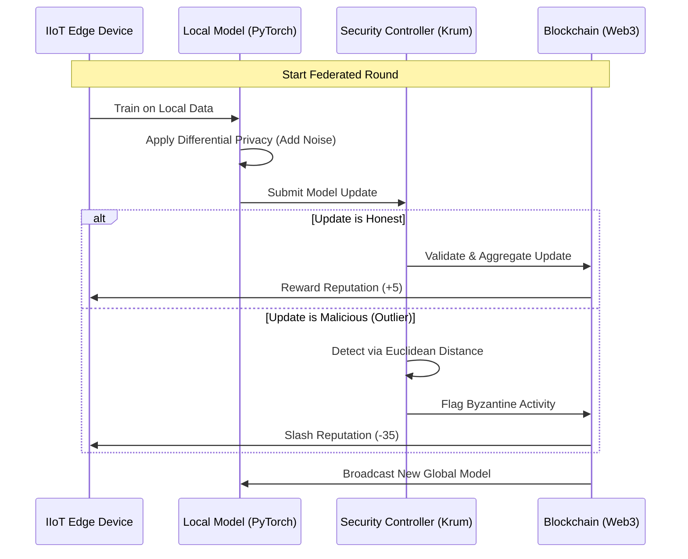
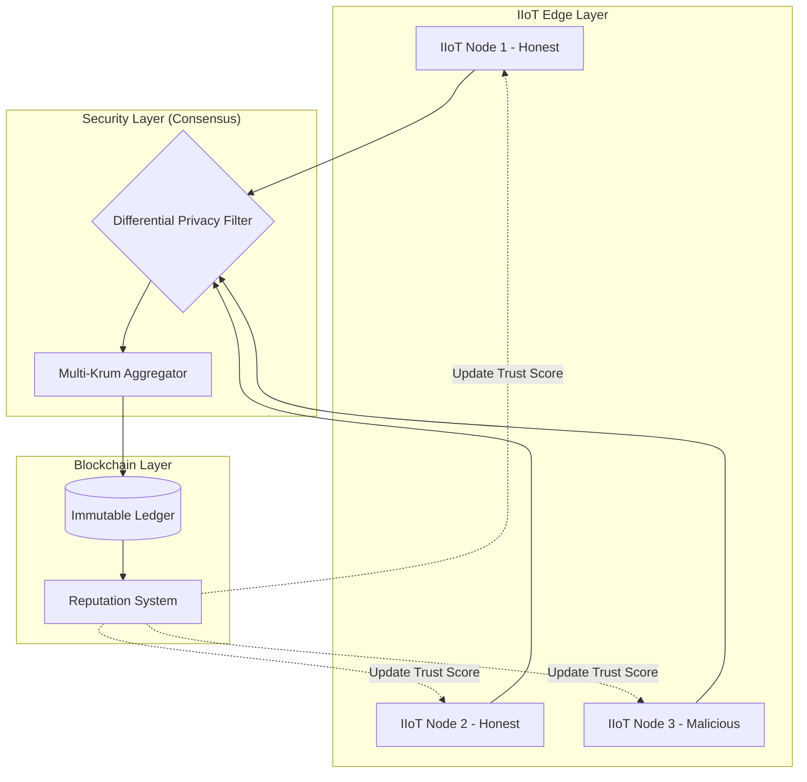

# Topic: A Blockchain-Integrated Framework with Byzantine-Robust Aggregation and Differential Privacy

## 📖 Project Overview
This project addresses the critical security gaps in Industrial Internet of Things (IIoT) networks. Traditional centralized AI models expose sensitive industrial data to leakage and are vulnerable to single points of failure.

Our solution implements a Decentralized Security Operations Center (SOC) that uses Federated Learning to train malware detection models locally on edge devices. To ensure the system is "Trustless," we integrate Blockchain-based Reputation and Multi-Krum Consensus to automatically detect and "slash" malicious actors attempting model poisoning attacks.

## 🚀 Key Features
- Decentralized Training: Local data never leaves the IIoT device.
- Differential Privacy: Gaussian noise injection ensures $(\epsilon, \delta)$-privacy.
- Byzantine Resilience: Krum Aggregation filters out malicious "Poisoned" updates.
- Blockchain Ledger: A simulated Ethereum-backed trust system with automated slashing logic.
- Live SOC Dashboard: Real-time visualization of network health, node reputation, and security alerts.

## 🏗️ Mathematical Framework

1. Differential Privacy (DP)

To prevent data re-identification, we apply the Gaussian Mechanism to local gradients $\Delta w$:

$$\Delta \tilde{w} = \Delta w + \mathcal{N}(0, \sigma^2)$$

Where $\sigma$ is the noise multiplier adjusted via the dashboard to balance the Privacy-Utility Trade-off.

2. Byzantine-Robust Consensus (Multi-Krum)

Standard averaging (FedAvg) is vulnerable to malicious outliers. We implement Krum Aggregation, which selects updates based on Euclidean distance ($L_2$ norm):

$$Score(i) = \sum_{j \in \text{neighbors}} ||w_i - w_j||^2$$

The aggregator selects the update $i$ with the minimum score, effectively isolating attackers (like Node 3) whose updates are mathematically distant from the honest majority.

3. Reputation & Slashing Logic

Network trust is managed via a dynamic reputation function $R$:

- Honest Participation: $R_{t+1} = R_t + 5$
- Malicious Detection: $R_{t+1} = R_t - 35$

### 🔄 Logical Data Flow

### 🗺️ System Topology

## 📊 Scientific Evaluation

The Analytics Tab in the dashboard provides a simulated evaluation of the model performance. It demonstrates that while increasing Privacy Noise ($\sigma$) protects data, it leads to a non-linear decay in accuracy, following the curve:

$$Accuracy \approx 0.5 + (Base - 0.5) \cdot e^{-\sigma \cdot 0.45}$$

This allows researchers to find the "Sweet Spot" for IIoT security deployments.

## 🛠️ Installation & Setup

Clone the Repository:
- git clone https://github.com/MoriartyPuth/Decentralized-Threat-Intelligence

Install Dependencies:
- pip install -r requirements.txt

Run the Dashboard:
- python -m streamlit run app.py

## 🖥️ Dashboard Preview

## ⚖️ Disclaimer

This project is intended for defensive and educational purposes only. It does not provide offensive tooling or exploit code.

